# Tasks

All tasks run in the same three-room house: a native RoboCasa kitchen, a dining room whose
table serves as the office desk, and a living room with a side table. The robot is a TidyBot++
holonomic base (0.481 m square footprint) with a Franka FR3 arm mounted 0.335 m above the floor
and a Robotiq 2F-85 gripper with finite rubber pad contacts.

Every run writes to its `--output` directory:

| File | Contents |
|---|---|
| `report.json` | `success`, the measured goal predicates (`composite_goal_evidence`), every stage with its measurements, accepted and rejected trials |
| `task_manifest.json`, `instruction.txt` | the episode as authored, and the instruction a policy would receive |
| `trace.json` | full simulator state every 0.04 s of the accepted execution |
| `trace_trimmed.json` | the same with motionless pauses removed; the videos are rendered from it |
| `rejected_trials/` | diagnostics for every candidate the controller tried and rolled back |
| `*.mp4` | overview, manipulation detail and wrist camera, rendered after physics ends |

## Breakfast for two

```bash
python -m cross_episode_sim.tasks.breakfast.gather --seed 17 --output runs/breakfast
```

**Instruction** (`instruction.txt`, the only text a policy should see):

> Prepare breakfast for 2 people at the office desk. There are exactly 2 cups and 2 bowls in the
> household. Find the empty vessels and gather them on clear kitchen work surfaces: counters,
> islands, kitchen tables, or a switched-off stovetop. Open and close storage as needed. An empty
> vessel already at the desk must come back for filling. Withdraw, leave your gripper empty, and
> wait for the human to put small food pieces in the bowls and small edible pieces in the cups.
> After observing the filled contents, carry those same vessels to the office desk and arrange
> one cup and one bowl per person. Finish with the contents retained, storage closed, and your
> gripper empty.

The "office desk" is the table in the dining room.

**Episode.**

1. *Gather.* Two mugs and two bowls start in the dining room, living room and kitchen
   (`initial_sources` in the config); one mug starts on the desk itself. Each is picked,
   carried upright and placed on a free kitchen work surface. Surfaces are chosen before
   navigating, ranked by clearance around the vessel and for the approach; a switched-off stove
   top is allowed.
2. *Fill.* A simulated person drops food into each vessel: free rigid bodies chosen at random,
   per seed, from 98 qualified food assets in 12 categories (sugar cubes, ice, dough balls, fruit,
   potatoes, …) that fit the vessel's measured cavity. Mugs exclude non-drink foods.
3. *Serve.* Each filled vessel is carried to its place setting on the desk without
   tipping, released and the arm withdrawn.

**Success** (`composite_goal_evidence`): every vessel is supported by the desk within 10 cm of
its setting and within 20° of upright, its food is still inside the cavity, the fill event
happened, storage is closed and the hand is empty.

**Variation.** `--seed` selects food fillings, source positions along reachable table edges and
small furniture offsets. `configs/breakfast_gather_fill_serve.json` defines a schedule of
day-to-day changes (objects every day, furniture and clutter every two days), producing a
history of past episodes in the same house. `--people 1` serves one setting; `--sources storage`
starts one mug in a drawer and one bowl in a cabinet.

**Validated.** Seed 17 (816 s simulated, 13 trips, no in-place turns); seeds 17 and 18 for
randomized fillings; seed 17 with `--sources storage` (1381 s simulated: drawer and cabinet
opened, emptied and closed; [preview](previews/breakfast-storage.gif),
[video](videos/breakfast-storage.mp4)).

## Making espresso

```bash
python -m cross_episode_sim.tasks.coffee.workflow --output runs/coffee
```

The espresso machine is MoonlakeAI's model, converted to MJCF with regenerated collision hulls.

1. Grasp the seated portafilter handle, twist 50° to unlock the bayonet, lower and withdraw it,
   and set it on the counter.
2. Pick up the open grounds box and pour its 32 granules into the basket.
3. Park the empty box, regrasp the filled portafilter, insert it and twist it locked.
4. Place the mug on the drip tray under the spout.
5. Press the power button and withdraw; wait for the ready state.
6. Press the brew button and withdraw; wait for the brew cycle.

**Success:** all 32 granules in the installed basket, portafilter locked, mug under the spout,
both buttons pressed by finger contact and released, the brew cycle completed, an empty hand,
and contact penetration within limits (robot/scene ≤ 1 mm, finger/object ≤ 1.5 mm).
`--through <stage>` stops after a stage (`remove`, `dose`, `reinstall`, `cup`, `power`, `press`).

**Physics.** The portafilter is a free body held by friction; two passive connect constraints
model the bayonet axis and disengage only after a measured unlock twist, and a weld models the
locked state. Buttons are spring-return slide joints moved by the fingertip. Brewing is a timed
state model with no fluid or heat simulation.

**Validated.** One run, 330 s simulated, 32/32 granules captured, none spilled.

**Placement.** `--machine-slot main_counter|right_counter [--placement-seed N]` places the
apparatus at a random spot in a counter slot, or `--machine-offset DX DY` shifts it exactly.
The machine, portafilter, grounds box, mug spot and the robot's starting dock move together
(`tasks/coffee/placement.py`), so the episode is a rigid copy of the validated one. The main
counter slot spans -0.25 to +0.22 m between the sink and the stove (the paper towel holder is
removed when in the way); the right counter slot spans +1.53 to +1.60 m between the stove and the
fridge (its toaster and knife block are removed). Validated at -0.25, -0.08, 0, +0.08 and
+0.22 m on the main counter and +1.53 and +1.60 m on the right counter, 330-342 s each.

The apparatus can also stand on another surface at any facing:
`--machine-pose DX DY DZ YAW_DEG --support BODY` turns it about the machine mount and moves it,
and `placement.surface_placement(edge_point, outward, surface_z)` computes the pose that sets it
at a surface edge facing out, with the edge as far in front of the machine as the counter edge
was. All coffee geometry is expressed in the machine's frame (portafilter withdrawal, button
press, mug insertion, pour yaws, docks, robot spawn, cameras), and loose objects standing where
the apparatus goes are removed. A placement is rejected before the run when a room wall enters
the robot's working area (0.7 m left to 0.9 m right of the mount, from behind the dock to the
back wall line). Validated on the dining table's north edge at three spots along it (turned
180°, 9 cm lower) and the living-room side table's west edge (turned 270°, 14 cm lower),
322-337 s each; the side table's other edges are rejected for the east wall, and the dining
table's other edges have a chair where the robot parks.

**Two cups.** `--cups 2` brews two separate Mug_1 cups through the one spout. A second mug
starts on the counter right of and in front of the first (`--second-mug-xy X Y` in the
machine's validated frame, default 2.55, -0.48). After the machine is prepared, each cup in
turn is fetched, placed under the spout, brewed, taken back out and set down at its own counter
spot; the power button is pressed once.

The mugs are moved with the atomic pick-and-place skills instead of an arm-only reach. The robot
tucks, docks beside the mug (`navigate_to_site`), grasps it by the top of the handle, folds it
in by the torso with the standard loaded carry (`tuck_for_navigation`), and drives back to the
machine dock; a brewed cup is carried folded to a dock beside its counter spot and set down.
`--mug-navigation off` keeps the robot at the machine dock and reaches the mugs from there.

Mug_1 is 104.2 mm tall and the spout leaves 105.1 mm above the drip tray, too little to take a
cup back out reliably, so the drip tray is seated 3 mm lower (`TRAY_DROP` in `brew.py`). The
cup slides out level at its resting height; pressing it down onto the tray tipped it, because it
is held by the handle. Mug poses are held to 1 mm and 0.5° under the basket.

**Success** with `--cups 2`: every cup brewed (two completed cycles, none aborted), every cup
back at its counter spot within 2 cm, and the portafilter, button, empty hand and penetration
checks above. Checkpoints are saved after each cup is placed and retrieved and at each switch
to the next cup; `--resume-from X --start next` resumes at placing the next mug (diagnostic
only: resumed runs are skipped by the data exporter).

**Validated.** Driving to each mug: one run, 738 s simulated, both cups brewed and returned.
Arm-only (`--mug-navigation off`): one run, 498 s simulated.

## Atomic skills

Each skill family is validated on at least one fixture and object. Launch a demonstration with
`scripts/run_skill.sh <skill> [output_dir]`.

| Family | Skill demos (video) | Validated on |
|---|---|---|
| Navigation | [cross-room](videos/cross-room.mp4) | same-room and cross-room routes, empty and carrying, honey bottle |
| Pick and place | [cross-room](videos/cross-room.mp4), [drawer-pick-place](videos/drawer-pick-place.mp4), [oven-pick-place](videos/oven-pick-place.mp4), [cabinet-transfer](videos/cabinet-transfer.mp4)¹ | table, counter, drawer and oven rack; honey bottle and egg |
| Open/close doors | [cabinet-door](videos/cabinet-door.mp4), [oven-rack](videos/oven-rack.mp4) | native cabinet door; Oven031 drop-down door |
| Open/close drawers | [drawer](videos/drawer.mp4), [drawer-loop](videos/drawer-loop.mp4) | one native kitchen drawer, with release and regrasp |
| Twist knobs | [stove-knob](videos/stove-knob.mp4) | Stove002 burner knob on and off |
| Turn levers | [faucet](videos/faucet.mp4), [toaster-lever](videos/toaster-lever.mp4) | sink faucet on and off; Toaster033 lever |
| Press buttons | [microwave-button](videos/microwave-button.mp4) | microwave Start and Stop |
| Insertion | [toaster-insertion](videos/toaster-insertion.mp4) | SandwichBread005 into Toaster033 |
| Slide racks | [oven-rack](videos/oven-rack.mp4), [oven-pick-place](videos/oven-pick-place.mp4) | Oven031 upper rack, empty and loaded |
| Open/close lids | [blender-lid](videos/blender-lid.mp4) | Blender008 lid removed, set down and reseated |

Time-lapse previews (click a name for the full video, or see the
[project page](https://plnguyen2908.github.io/cross-episode-robotics-sim/)):

| | |
|---|---|
| 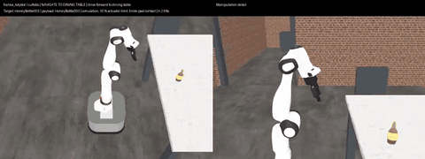<br>[cross-room](videos/cross-room.mp4) | 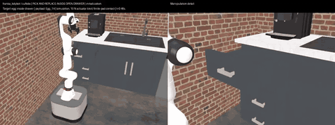<br>[drawer-pick-place](videos/drawer-pick-place.mp4) |
| 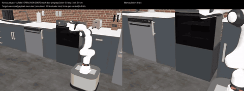<br>[oven-pick-place](videos/oven-pick-place.mp4) | 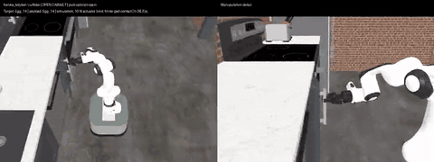<br>[cabinet-transfer](videos/cabinet-transfer.mp4) |
| 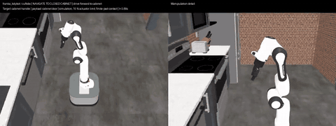<br>[cabinet-door](videos/cabinet-door.mp4) | 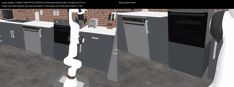<br>[oven-rack](videos/oven-rack.mp4) |
| 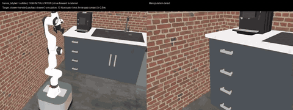<br>[drawer](videos/drawer.mp4) | 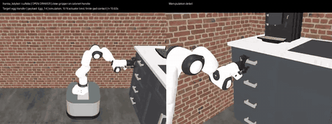<br>[drawer-loop](videos/drawer-loop.mp4) |
| 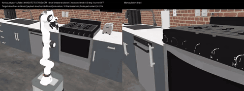<br>[stove-knob](videos/stove-knob.mp4) | 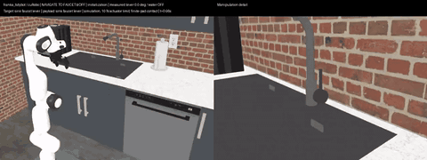<br>[faucet](videos/faucet.mp4) |
| 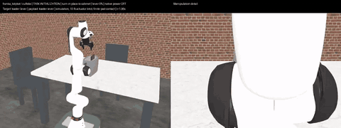<br>[toaster-lever](videos/toaster-lever.mp4) | 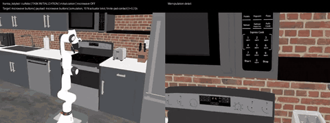<br>[microwave-button](videos/microwave-button.mp4) |
| 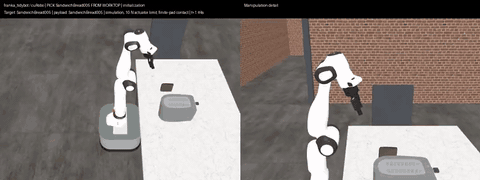<br>[toaster-insertion](videos/toaster-insertion.mp4) | 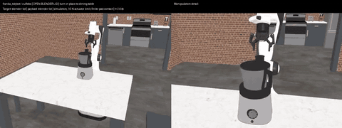<br>[blender-lid](videos/blender-lid.mp4) |

These are the tested ranges, not promises for every RoboCasa asset: the drawer travelled 20 cm
(35 cm in the transfer setup), the oven door opened 65.9° within its 1.15 rad limit and the rack
extended about 15 cm.

### ¹ Known issue: cabinet round trip is unreliable

`cabinet-transfer` passed once with the old slow motion profile, and 1 of 6 runs with the shared
fast profile. It fails at one of two points, depending on where the object comes to rest after it
is released on the shelf:

- **The object is released tilted, so it rolls or tips.** The hand stays horizontal to fit the
  cabinet opening, which leaves the held object leaning (the egg's side grasp, or about 30° for the
  honey bottle), and the gripper body hangs below the object, so it cannot be lowered onto the
  shelf; it drops about 1.5 cm. The egg then rolled 4-6 cm forward or back at random; the bottle
  tipped over toward the robot.
- **Shallow releases fall off, deep releases are out of reach.** Released 5 mm inside the front
  edge, the object rolls or tips off the shelf. Released 6 cm in, it can end up beyond the reach
  of every cabinet dock, and retrieval finds no plannable grasp (`No saved grasp plan after
  bounded alternate navigation stances`).

Ruled out: the base yaw (blended turning leaves `base_theta` at -4.712 rad, but the planner uses
the live base transform), the door (89° open in every run) and the grasp set (diagonal shelf
grasps raised the retrieval hypotheses from 8 to 36 without a success).

The fix is to release the object upright: choose the hand pitch, within the opening's limits,
that makes the held object vertical, so it cannot tip or roll and a shallow placement stays put
and within reach.

## How demonstrations are produced

The demonstrator is an oracle: it reads object poses and collision geometry from the simulator,
plans base routes with an SE(2) A* over MuJoCo collision probes, and plans arm motion with
cuRobo. Each skill is a transaction (see [architecture.md](architecture.md)): the simulator is
checkpointed, a candidate dock or grasp is tried, a measured postcondition decides, and failures
are rolled back before the next candidate. The saved trace therefore contains only the accepted
branch; rejected tries are kept separately for analysis.

Every task shares one motion profile. The base turns while it drives (`--base-motion blended`,
falling back to turn-then-drive where a blended sweep is not clear) and turns at 0.4 rad/s. After
each arm, gripper or base motion the controller advances as soon as the measured motion is
finished instead of waiting a fixed time, bounded by the old fixed wait; while an object is held,
the arm must be four times stiller (0.005 rad/s per joint) and the object itself at rest, so a
released object is not knocked. Videos drop idle pauses. Compared with the earlier slow profile,
the skill demonstrations take 1.0-4× less simulated time (about 105 min to 55 min in total).
